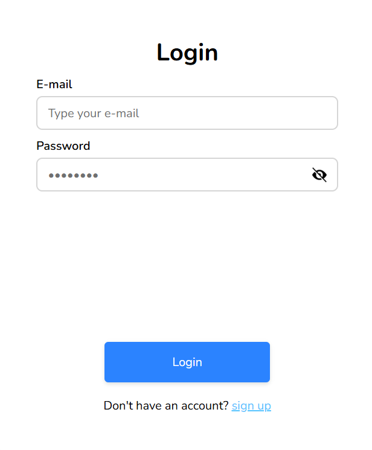
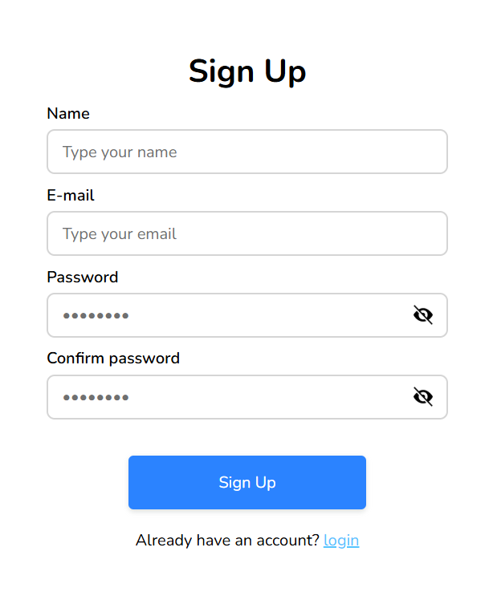
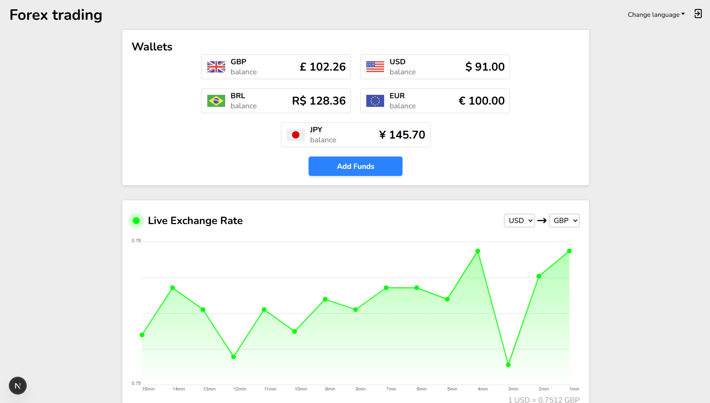
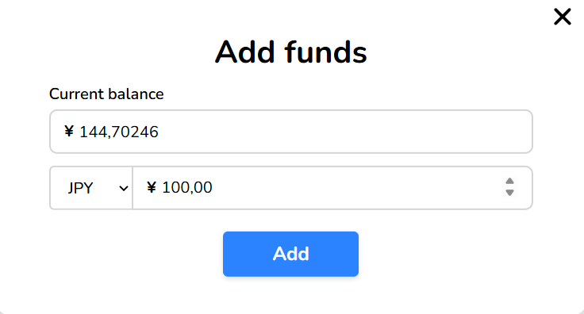
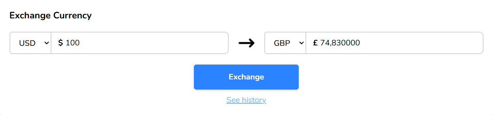
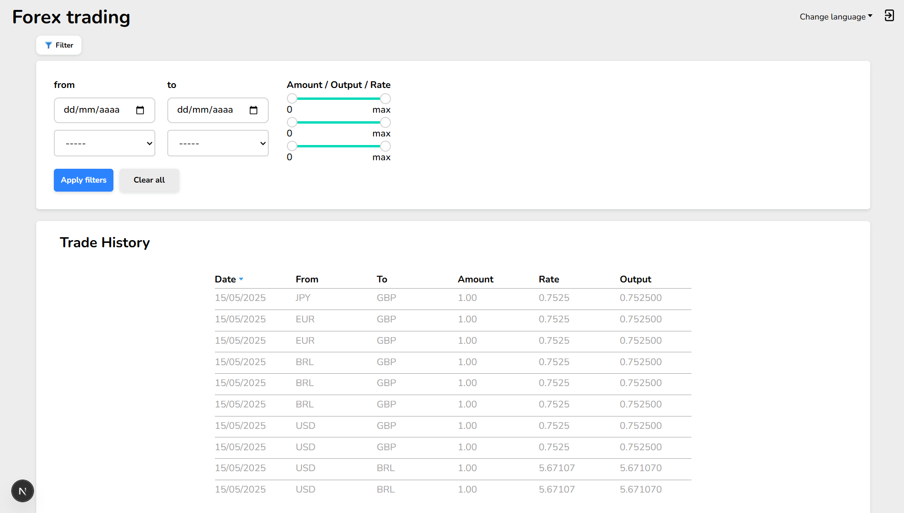

## Project Overview

**Forex trading** is a web application that lets you manage multiple currency wallets and perform real-time exchanges between them using up-to-date exchange rates. Whether you’re tracking personal finances or simulating currency trades, Wallet Manager gives you a clear, centralized dashboard.

## Features

* **Multi-currency support**
  Create and track wallets in any currency (USD and GBP).
* **Real-time exchange**
  Convert funds between wallets using live exchange rates.
* **Transaction history**
  View detailed records of exchanges.
* **Responsive UI**
  Seamless experience on desktop and mobile devices.
* **Hubspot Integration**
  see exchanges made and funds added for each customer with hubspot

# How to use

## Login or Signup

Create a counter or join an existing one

> **Login & Signup**
>
>   
>   

---

## Dashboard Walkthrough

After logging in, you’ll land on the **Dashboard**, which shows:

* **Portfolio Overview**: Balance per currency
* **Value Chart**: Interactive graph of each currency’s latest value

> **Portfolio Dashboard**
>
>   

---

## Adding Funds

Click the **Add Funds** button next to any currency to top up your wallet:

1. Enter the **amount** in the form.
2. Click **Add** to update your portfolio balance.

> **Add Funds Form**
>
>   

---
## Currency Exchange

Use the **Exchange** section to convert between two currencies:

1. Select the **source** and **target** currencies.
2. Enter the **amount** to convert.
3. Click **Exchange** to execute the trade at the current rate.

> **Exchange Section**
>
>  

---
## Trade History

Navigate to **Trade History** to see all your past transactions:

* **Filter** by date, currency pair, or trade type (add funds vs. exchange).
* **Sort** by date or amount to quickly find specific trades.

> **Trade History**
>
>   

---

# How to run
## Prerequisites

* [Docker](https://www.docker.com/)
* [Docker Compose](https://docs.docker.com/compose/)

## Configuration

1. **Clone the repository**

   ```bash
   git clone git@github.com:nichol20/forex-trading-app.git
   cd forex-trading-app
   ```
2. **Environment variables**
   Copy example files and set your own values:

   ```bash
   cp server/.env.example server/.env
   cp client/.env.example client/.env
   cp postgres/.env.example postgres/.env
   cp redis/.env.example redis/.env
   ```

3. **Server configuration**
    Fill the following variables in the .env file:
    * `EXCHANGERATE_API_KEY`: Your access key for the currency rates service
        - get it on [fastforex website](https://www.fastforex.io/)
    * `HUBSPOT_API_KEY`: Your access key for the hubspot API
        - Get it by following HubSpot's [step-by-step guide](https://developers.hubspot.com/docs/guides/apps/private-apps/overview) on how to create a private app
        - make sure you have the following scopes configured:
            - `crm.objects.contacts.read`
            - `crm.objects.contacts.write`
            - `crm.objects.deals.read`
            - `crm.objects.deals.write`
            - `crm.schemas.contacts.read`
            - `crm.schemas.contacts.write`
            - `crm.schemas.deals.read`
            - `crm.schemas.deals.write`

## Running the Application

All services are containerized and orchestrated with Docker Compose.

1. **Start all services**

   ```bash
   docker compose up -d
   ```
2. **Backend (Server)**

   ```bash
   docker compose exec server sh
   npm install              # if first time
   npm run setup-hubspot    # if first time, setup hubspot with required properties and groups
   npm run dev              # launches the server in development mode
   ```
3. **Frontend (Client)**

   ```bash
   docker compose exec client sh
   npm install              # if first time
   npm run dev              # launches the NextJS app in development mode
   ```

Once both services are running, open your browser to `http://localhost:3000`.

## Additional Tips

### Running Tests
1. **Backend (Server)**

    ```bash
   npm run test
   ```

2. **Frontend (Client)**

    ```bash
    npm run test
    ```


### Inspect Database
1. **Pgadmin**
    * If you want to inspect database details, you can open pgadmin via the url [http://localhost:8888](http://localhost:8888)
    * If you haven't changed your .env file, you should be able to log in with these credentials `admin@user.com` and `secret`
    * Register a server with this connection configuration (default .env config):
        - Address (docker compose service name): `postgres`
        - Database: `forex`
        - Username: `postgres`
        - Password: `postgres`
2. **PSQL**
    * If you want to use the psql cli, run the command:
        ```bash
        docker compose exec postgres psql -U postgres -d forex
        ```
    * Command example:
        ```SQL
        SELECT column_name FROM information_schema.columns WHERE table_name = 'users';
        ```

### Inspect Redis

Run the command:
```bash
docker compose exec redis redis-cli
```